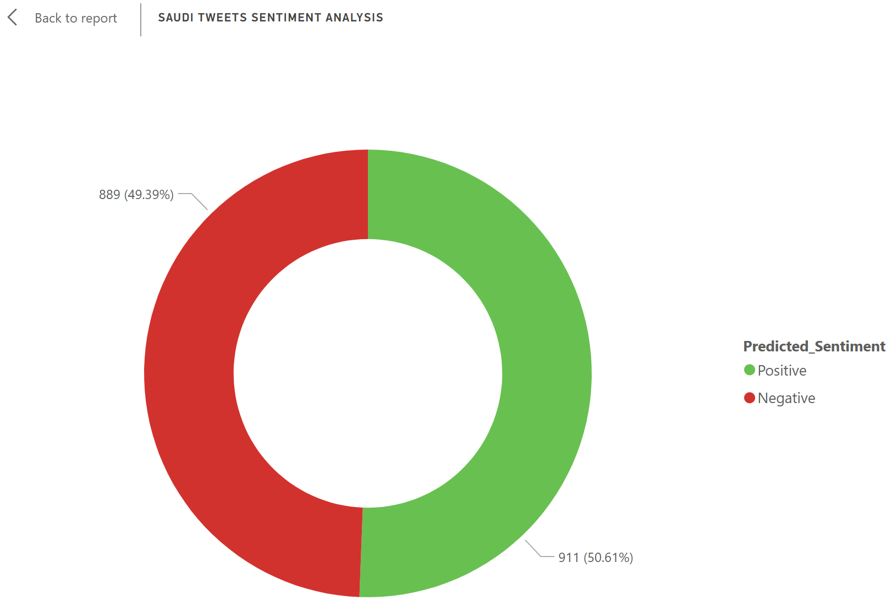

# 🇸🇦 Saudi Tweets Sentiment Analysis (NLP)

## 📌 Project Overview
An End-to-End Natural Language Processing (NLP) project designed to analyze Arabic tweets (specifically Saudi/Gulf dialects) and classify sentiments as **Positive** or **Negative**. This project bridges the gap between **AI modeling** and **Business Intelligence**.

## 🚀 Business Value
Understanding public sentiment on social media is crucial for brands and government entities. This model allows organizations to:
* Monitor brand reputation in real-time.
* Filter customer feedback automatically.
* Visualize public opinion trends using data analytics.

## 🛠️ Technical Approach
1.  **Data Pipeline:** Ingested raw Arabic tweets (AJGT Corpus).
2.  **Advanced Preprocessing:**
    * Implemented a custom cleaning function to handle Arabic text.
    * Removed Diacritics (Tashkeel), Tatweel, and non-Arabic characters.
    * Normalized specific characters (Alef normalization).
3.  **Modeling:**
    * Used **TF-IDF Vectorizer** (Top 5000 features) to convert text to numerical data.
    * Trained a **Multinomial Naive Bayes** classifier (Standard for text classification).
4.  **Evaluation:** Achieved **83.9% Accuracy** on unseen test data.

## 📊 Results
* **Accuracy:** 83.89%
* **Precision/Recall:** High performance in detecting both Positive and Negative sentiments.
* **Output:** Generated a processed dataset ready for Power BI visualization.

## 💻 Tech Stack
* **Python** (Core Logic)
* **Scikit-Learn** (ML Pipelines)
* **Pandas & NumPy** (Data Manipulation)
* **NLTK / RegEx** (Text Processing)

## 🚀 How to Run
1.  Clone the repo.
2.  Install dependencies: `pip install pandas scikit-learn openpyxl`.
3.  Run the notebook.

## 📊 Dashboard Visualization
Here is the Sentiment Analysis result visualized using Power BI:

> **Note:** You can download the full Power BI file (`.pbix`) from the repository files above to explore the interactive dashboard.
